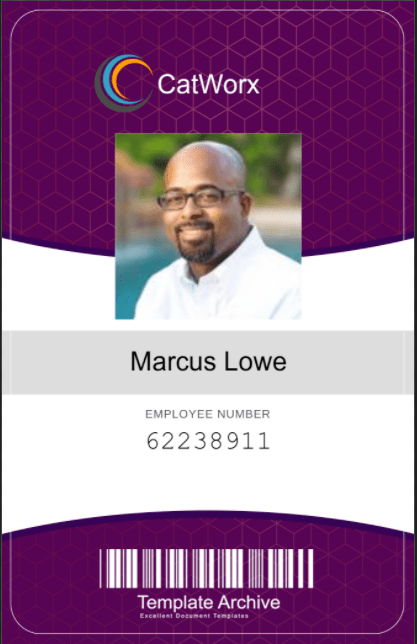

# CatWorx BadgeMaker

  
    
  
   
  
   
  
   
  
   
  
  
  ## Description
  
  ### Use C# to build a console app that creates employee security badges for a rapidly expanding startup, CatWorx. We will use the .NET framework to import libraries that let you read and write to the file system, query APIs, and generate images.
  
  ### This process includes the following:
   
  * Set up a C# environment
  * Declare and use typed data
  * Print output and read user input from the console
  * Store collections of data in Arrays, ArrayLists, and Dictionaries, and Boolean values
  *  Declare and call methods
  * Declare a statically typed variable
  * Use namespaces and statements to organize code and classes to implement object-oriented architectures
  * Interact with users via the command-line interface (CLI)
  * Iterate using for loops
  * Use pseudocode to break down each step ahead of time and outline your workflow
  * Compile and run application in VS Code

 
  ## Table of Contents
  - [Description](#description)
  - [Documentation](#documentation)
  - [Usage](#usage)
  - [Screenshot](#screenshot)
  - [Features](#features)
  - [Acknowledgements](#acknowledgements)
  - [License](#license)
  - [Testing](#testing)
  - [Contact](#contact)

  ## Documentation
  TBD
 
  ## Usage
  TBD

  ## Screenshot
  

  ## Features
  TBD
  
  # Acknowledgements
  Rob Atalla
    
  ## License
  
   
  Permission to use this application is granted under the MIT license. <https://opensource.org/licenses/MIT>

  ## Testing
  TBD

  ## Contact:
  Holler at me! <a href="mailto:rob.atalla@robatalla816.com">rob.atalla@robatalla816.com</a>